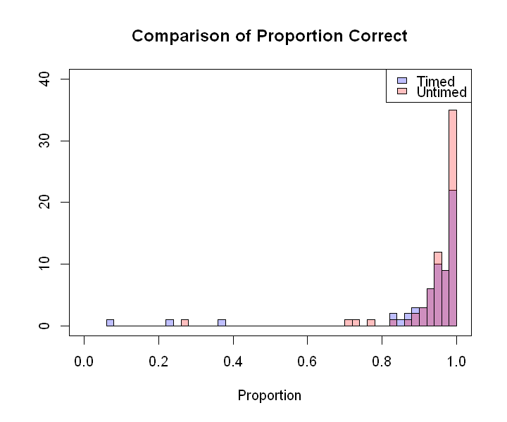
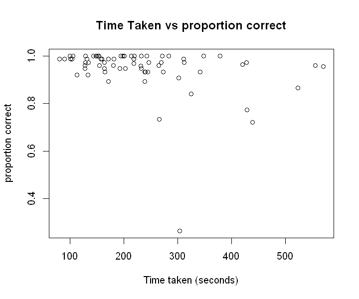
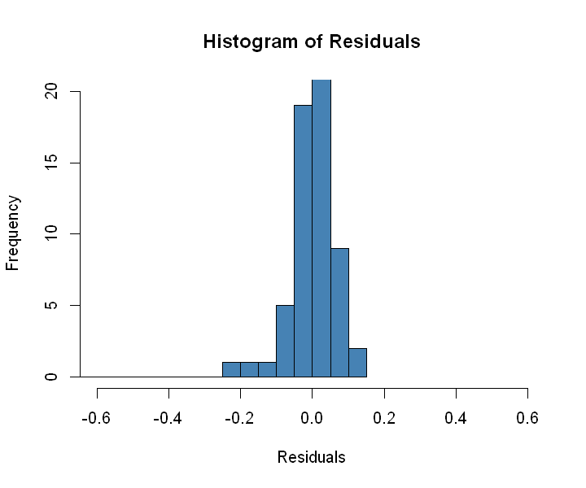
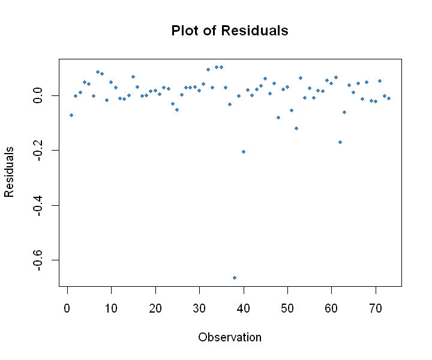
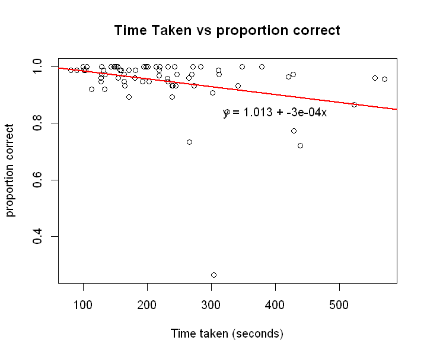
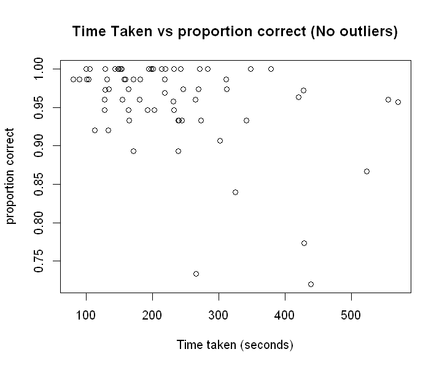
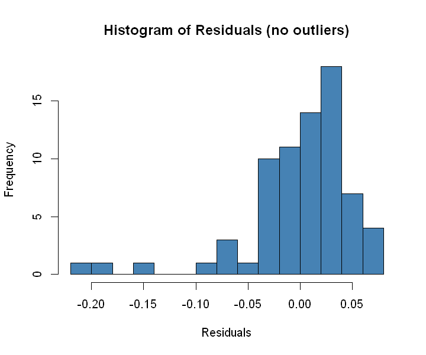
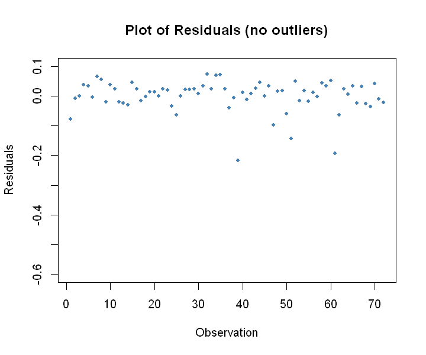
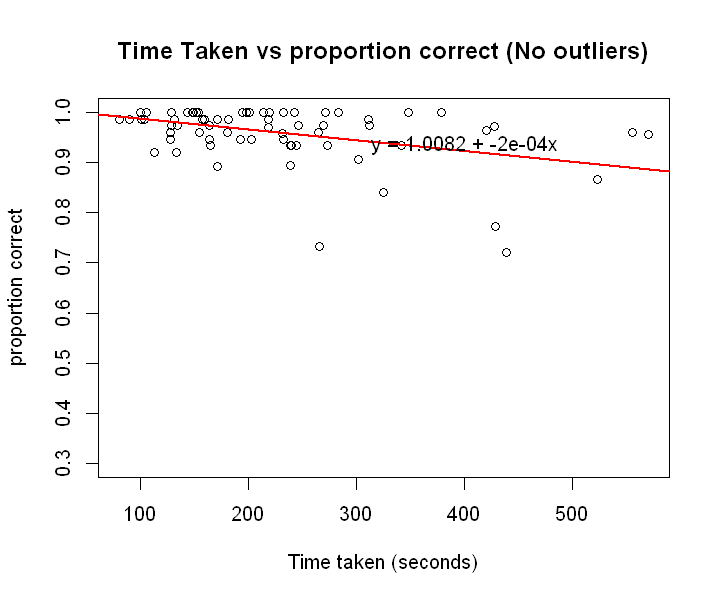

# Do people perform worse with a time limit? 
## We study this we study this question in great detail.
We will first run a hypothesis t-test for difference in mean score (proportion correct), 
and then we will run a t-slope test for time taken, and proportion correct

### Explaining sample size
The following is a calculator of sample size given a margin of error and standard deviations.
The standard deviation of proportion correct for those with the timed treatment was .1149091. 
The standard deviation of proportion correct for those with the untimed treatment was .03679801

> These standard deviations came from a test run.

61

This means that I need 61 trials for each treatments, totalling to 122.

First, we will import our dataset

<ol class=list-inline><li>137</li><li>6</li></ol>

we also have outliers, so we also have a separate dataset, where we filtered those out.

<ol class=list-inline><li>132</li><li>6</li></ol>

Then, lets split into our two treatments:

       proportion     
     Min.   :0.06667  
     1st Qu.:0.93333  
     Median :0.96721  
     Mean   :0.91859  
     3rd Qu.:0.98571  
     Max.   :1.00000  

       proportion    
     Min.   :0.2639  
     1st Qu.:0.9467  
     Median :0.9733  
     Mean   :0.9504  
     3rd Qu.:1.0000  
     Max.   :1.0000  

### Difference in mean score

Lets check conditions yeah?
### CONDITIONS
1. independently chosen samples
2. Each sample is random
3. each sample is less than 10% of the population.
4. Both histograms are unimodal and symmetric OR large sample sizes

73

61

72

59

    

    

    
    	Welch Two Sample t-test
    
    data:  untimed["proportion"] and timed["proportion"]
    t = 1.3059, df = 94.05, p-value = 0.1948
    alternative hypothesis: true difference in means is not equal to 0
    95 percent confidence interval:
     -0.01652737  0.08004649
    sample estimates:
    mean of x mean of y 
    0.9503531 0.9185935 
    
    

### Difference in mean score but without outliers

    
    	Welch Two Sample t-test
    
    data:  untimed_no["proportion"] and timed_no["proportion"]
    t = 1.1597, df = 96.529, p-value = 0.249
    alternative hypothesis: true difference in means is not equal to 0
    95 percent confidence interval:
     -0.01092293  0.04162846
    sample estimates:
    mean of x mean of y 
    0.9598873 0.9445345 
    
    

### T-slope test
For those who took th test untimed, is there a relationship with the time they took, and the proportion they got correct?

### Checking conditions.
1. Association is Linear (kinda)
2. sample < 10% of population (yes, it should be)
3. histogram of residuals is approx normal Observe.
4. Residuals plot has equal variablilty (sure)

This looks pretty linear:

    

    

Starting with the histogram, we can see its approx normal

    

    

We can satisfy the 10% condition by looking at our sample size: 45. Its definitely less than 10%

73

Now for homoscedasticity: If this isnt homoscedastic, I dont know what is bro.

    

    

R has no t-slope test built in, but we can get the values doing basic linear regression

    

    

    
    Call:
    lm(formula = proportion ~ et, data = untimed)
    
    Residuals:
         Min       1Q   Median       3Q      Max 
    -0.66478 -0.01004  0.01697  0.04107  0.10168 
    
    Coefficients:
                  Estimate Std. Error t value Pr(>|t|)    
    (Intercept)  1.0130498  0.0259423  39.050   <2e-16 ***
    et          -0.0002776  0.0001036  -2.678   0.0092 ** 
    ---
    Signif. codes:  0 '***' 0.001 '**' 0.01 '*' 0.05 '.' 0.1 ' ' 1
    
    Residual standard error: 0.09546 on 71 degrees of freedom
    Multiple R-squared:  0.09173,	Adjusted R-squared:  0.07894 
    F-statistic: 7.171 on 1 and 71 DF,  p-value: 0.009198
    

Our t-stat slope statistic can be found here:

    [1] "T-Statistic -2.67786267933282"
    [1] "P-Val 0.00919816714206645"
    

### T slope test without outliers

### Checking conditions.
1. Association is Linear (kinda)
2. sample < 10% of population (yes, it should be)
3. histogram of residuals is approx normal Observe.
4. Residuals plot has equal variablilty (sure)

This looks pretty linear:

    

    

So lets, begin. First, the residual histogram is approx normal

    

    

By looking at the sample (removed outliers) 44 is definitely less than 10% of highschoolers.

72

And by looking at the residuals plot, it seemds to be homoscedastic.

    

    

    

    

    
    Call:
    lm(formula = proportion ~ et, data = untimed_no)
    
    Residuals:
         Min       1Q   Median       3Q      Max 
    -0.21770 -0.01845  0.01263  0.03257  0.07327 
    
    Coefficients:
                  Estimate Std. Error t value Pr(>|t|)    
    (Intercept)  1.008e+00  1.437e-02  70.150  < 2e-16 ***
    et          -2.150e-04  5.761e-05  -3.732 0.000382 ***
    ---
    Signif. codes:  0 '***' 0.001 '**' 0.01 '*' 0.05 '.' 0.1 ' ' 1
    
    Residual standard error: 0.05287 on 70 degrees of freedom
    Multiple R-squared:  0.166,	Adjusted R-squared:  0.1541 
    F-statistic: 13.93 on 1 and 70 DF,  p-value: 0.0003825
    

    [1] "T-Statistic -3.73243147517456"
    [1] "P-Val 0.00038246485681516"
    
